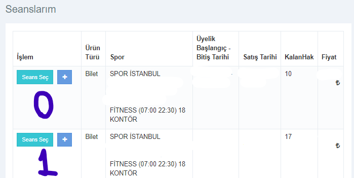
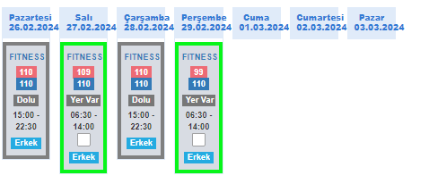
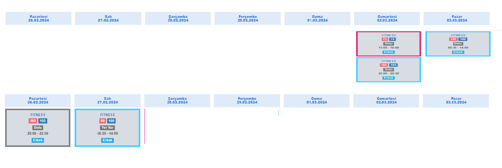

# Online Spor Istanbul Randevu Botu

Bu bot, online.spor.istanbul web sitesinde randevu almak için otomatik olarak işlemleri gerçekleştiren bir Puppeteer tabanlı bir bot scriptidir.
Asıl amacımız randevu almayı unuttumuz ya da randevu kontenjanın dolması sebebiyle randevu alamamayı engellemektir.
Sadece kisisel kullanım için geliştirilmiştir.
## Kurulum
0. `.env` dosyası olusturun ve sırasıyla aşağıdaki bilgileri kendinize gore ekleyine.
   - TC_NO=12345678
   - SPOR_ISTANBUL_PASSWORD=26981037
   - API_KEY=2CHAPTCHA_API_KEYINIZ
1. Projeyi klonlayın veya ZIP olarak indirin.
2. Proje dizinine gidin: `cd randevu-botu`
3. Gerekli Node.js bağımlılıklarını yüklemek için terminal veya komut istemcisinde şu komutu çalıştırın: `npm install`

## Kullanım

0. Bu bot şuan gelişim aşamasındadır. Bu yüzden kullanımı için biraz teknik bilgi gerekmektedir.
1. Proje dizinindeki `randevu.js` dosyasını bir metin düzenleyicide açın.
2. Kodun içinde bulunan `"anahtarınız"` kısmını kendi 2CAPTCHA API https://2captcha.com/ anahtarınızla değiştirin.
3. Terminal veya komut istemcisinde proje dizininde şu komutu çalıştırın: `node randevu.js`
4. Bot, tarayıcı penceresi açarak işlemleri gerçekleştirecektir. Botun tamamlanmasını bekleyin.

   - Oncelikle şu anlık sadece gittiğim belediyedeki fitness programın uygundur.
   - Oncelikle seçtiğiniz programın seans seçim ekranında kaçıncı olduğunu bilmeniz gerekmektedir
   - 
   - Ustte gorundüğü şekilde eğer en üstteki seansı değil de 1 no'lu seçecekseniz randevu.js dosyasına gelip
   - ```javascript
      const sporNo = "0";
     ```
    kısmında 0 olan yeri ``1`` yapmalısınız. 
    - Ayrıca randevu almak istediğiniz tarihlerin saatlerini aşağıdaki gibi belirlemelisiniz.
    - 
   - 
   - 
    - Randevularda eğer 1.hafta ile 2. haftadan da randevular gözüküyorsa  orn (cts pz pzt sl) 2 haftalık gösterilir.
    - eger randevular orn sl cr per cum tarihlerindeki gibi ise 1 haftalık gözükür.Ustteki gibi
    - bunu neden anlattım çünkü 2 haftalıkta sececeğimiz günün indeksi 0 13 arasında 
    - 1 haftalıkta ise 0 6 arasında olacaktır.
    - ustteki resimden ornegin persembeye randevu almak istiyorsanız indeksin 3 olması gerekmektedir.
    - INDEKS KODUNDA HATA VAR SUAN SADECE 2 HAFTALIK CALISIYOR BUNDAN DOLAYI 0 13 ARASINDA SAYI GİRİYOR
    - 1 HAFTALIGA DONUSTUGU ZAMAN DAHI 7 8 9 10 11 12 13 GIBI SAYILAR GİRİYOR BU OLMAMALI
    - EVET SIMDI HANGI SEANSI SECMENIZ GEREKTIGINI VE HANGI GUNLERDE SEANSLARIN OLDUGUNU BILMENIZ GEREKMEKTEDIR.
    - BUNU BILDIKTEN SONRA ASAGIDAKI KODU DUZENLEYIN ornegin 
      fitness randevuları için bu saatlerde schedule edip randevu alabilirsiniz.
      ```javascript
      // Burada gideceğiniz günleri ve saatleri belirleyeceksiniz eger haftada bir kez gidecekseniz 
      // zamanlar degiskenini ona göre düzenleyin
      // ilk sayı saniye ikinci sayı dakika üçüncü sayı saat 
      // son sayı günün adı 0 pazar 1 pazartesi 2 salı 3 carsamba 4 persembe 5 cuma 6 cumartesi
      // ancak randevu alacagımız güne özel suna yapmalıyız cunku biz 3 gun sonraya olan randevuyu alıyoruz.
      // siz kac gun sonraya alabiliyorsanız ona göre degistirin
      // pazar günü carsambaya saat 20:05
      // pazartesi persembe saat 06:35
      // salı cuma saat 20:05
      // carsamba cumartesi saat 15:05
      // persembe pazar saat 15:05
      // cuma pazartesi saat 20:05
      // cumartesi salı saat 06:35


          zamanlar=[
         "0 05 20 * * 0",
          "0 35 6 * * 1",
          "0 05 20 * * 2",
          "0 05 15 * * 3",
          "0 05 15 * * 4",
          "0 05 20 * * 5",
          "0 35 6 * * 6"]
      ```
    - Bu adımlardan sonra günü belirlemis olduk index hatasını da çözdüysek 
    - O günün hangi seansı oldugunu belirlemek kaldı. Eger farklı günlerde sabah akşam seanslarından birini degistiriyorsanız
    - indekse göre seaans numaranızı degistirmelisiniz.
   ```javascript
          //index eğer 0 2 4 7 9 11 ise seans index 1 değilse 0 olacak
         if (
          index === 0 ||
          index === 2 ||
          index === 4 ||
          index === 7 ||
          index === 9 ||
          index === 11
  ) {
    seansIndex = 1;
  } else {
    seansIndex = 0;
  }
   ```
- Bu kodla sabah mı akşam mı seçileceğini belirleriz.
- buradan sonrası herkeste aynı olacaktır.

  


## Geliştirme Süreci

- `randevu.js` dosyası botun ana kodunu içerir. Bu dosyayı düzenleyerek botun davranışlarını değiştirebilirsiniz.
- Geliştirme sürecinde Puppeteer kütüphanesi ve Puppeteer-Extra ile ilgili dokümantasyonu inceleyebilirsiniz.
- Kodun anlaşılması için yorum satırları eklenmiştir.

## Canlı Ortamda Kullanım
- su an deneyemedim ancak deneyen olursa sonucu paylasabilirse sevinirim. 

## Katkıda Bulunma

- Eğer bu projeye katkıda bulunmak isterseniz, lütfen bir pull request oluşturun.
- Randevu alınamadığı durumlar ayrıca işlenmelidir.
  - Ornegin telefonunuza bildirim yollanabilir alınıp alınmadığı ile ilgili
  - Eğer alınamadıysa tekrar denenebilir
- tarih ayarında bir hata olabilir. bununla ilgili bir kontrol mekanizması eklenmelidir.
  - randevu alınan tarih aralıgı 2 hafta 2 hafta seklinde mi gozukuyor yoksa kaydırmalı mı 
## Lisans

Bu proje MIT Lisansı altında lisanslanmıştır. Daha fazla bilgi için `LICENSE` dosyasını inceleyin.
